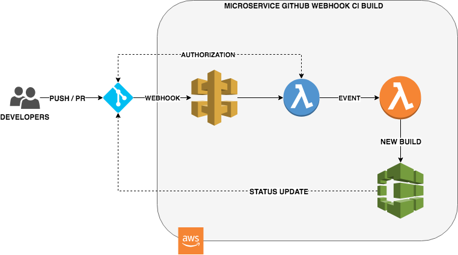

# GitHub webhook - CI pipeline

> API Gateway handling GitHub webhook and triggering a build of 
the given repo on PR and PUSH events. 

> Build status sent to GitHub using its API to enable / disable 
merging (branch protection).

You need the following components:
- **GitHub webhook** to be called on PR and PUSH events to any branch
- **API Gateway** to handle the webhook calls
- **Lambda** to authorize the request coming from GitHub
- **Lambda** to trigger the build
- **Codebuild** job, including the steps:
  - installing dependencies
  - build the project (compilation)
  - run the tests
  - callback to GitHub API for status update
  
The overall architecture is detailed here:


## Pre-requisites

- `AWS cli` installed
- Github account with repo containing a `build.sh` script at the root
- Github oauth token saved in AWS SSM parameter store as `GitHubOAuthToken`
- S3 bucket `${credential_aws_account_id}-build-resources` exists

## Automatic Setup

Run the following:
```bash
$ ./setup.sh -c <github_account> -r <github_repo_name>
```

This assumes the proper AWS cli credentials have been setup (run `AWS configure`).

This will setup the entire stack and dependencies in the `AWS runtime` environment.

(Note that the steps definitions are described below along with their manual 
commands equivalent).

You will only need to setup GitHub properly, see the `GitHub - Webhook Setup` 
section below.


### Codebuild - Buildspec Config File

Generate the Codebuild config file (`buildspec.yml`)
```bash
$ cd ci-build-config
$ ./package.sh
```

Upload the file into an S3 bucket, ie: `runtime-bucket/ci-pipeline/ci-build-config.zip`


### Lambda - API Authorizer

Generate the lambda package handling the API authorization.
```bash
$ cd ci-build-authorizer
$ ./package.sh
```

Upload the file into an S3 bucket, ie: `runtime-bucket/ci-pipeline/ci-build-authorizer.zip`

The lambda will be triggered by the API Gateway and make sure 
the requests are coming from GitHub servers.


### Lambda - Codebuild Trigger

Generate the lambda package handling the Codebuild trigger.
```bash
$ cd ci-build-trigger
$ ./package.sh
```

Upload the file into an S3 bucket, ie: `runtime-bucket/ci-pipeline/ci-build-trigger.zip`

The lambda will be triggered by the API Gateway (once request 
has been authorized), parse the GitHub event payload and trigger 
a new build of the `<github_repo_name>` in case of `PR` and `PUSH` 
events.


### Cloudformation - API Gateway

The last step is related to creating the API Gateway stack:
- Setup the Codebuild job
- Create the 2 lambdas described above
- Create the API Gateway

To do so, upload the `ci-build-stack.yml` into the Cloudformation console 
and configure the requested information.

You should just need to provide the S3 bucket containing the 
lambda code (where it has been uploaded on the previous steps).

Other information should be pre-populated.

The API Gateway endpoint will look like:
`https://xxx.execute-api.ap-southeast-2.amazonaws.com/WebhookStage/github-webhook`


## GitHub - Webhook Setup

Once all the AWS components have been setup, you will need to:
- Login into GitHub
- Go to the `github_repo_name` repo
- Go to the `Webhook` tab
- Setup a new webhook that points to the new API Gateway endpoint
- Select both `PR` and `PUSH` events
- Go to `Branches` tab and enable protection for `master` branch
- Select `Require status checks to pass before merging` 
- Select `Require branches to be up to date before merging`
- Tick `<github_repo_name>-ci-pipeline`


This will force GitHub to request a valid success `status` 
update before being able to merge into the `master` branch.
